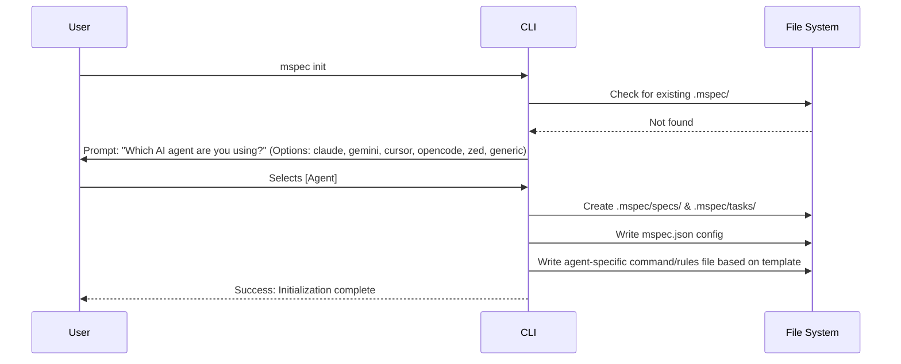

# mspec init Command

## Goal
Initialize the `mspec` environment in a project by prompting the user for their preferred AI agent and generating the appropriate configuration and custom instructions.

## Context
This command scaffolds the necessary directories and files to enable Spec-Driven Development (SDD) via AI agents. It ensures that the chosen agent (Claude, Gemini, Cursor, etc.) understands the `/mspec:spec`, `/mspec:plan`, and `/mspec:apply` workflows by injecting specific configuration files into the project.

## Logic Flow

## Data Dictionary (mspec.json)

| Field | Type | Description | Constraints |
| :--- | :--- | :--- | :--- |
| `agent` | `string` | The user-selected AI agent. | Enum: `claude`, `gemini`, `cursor`, `opencode`, `zed`, `generic` |
| `paths.specs` | `string` | Relative path to specifications. | Default: `.mspec/specs` |
| `paths.tasks` | `string` | Relative path to implementation tasks. | Default: `.mspec/tasks` |

## Output Files by Agent

The `init` command must generate instructions tailored to the selected agent:

*   **claude:** `.claude/commands/mspec.md` (Markdown format)
*   **gemini:** `.gemini/commands/mspec.toml` (TOML format)
*   **cursor:** `.cursor/rules/mspec.mdc` (Markdown/MDC format)
*   **opencode:** `.opencode/commands/mspec.md` (Markdown format)
*   **zed / generic:** `.mspec/INSTRUCTIONS.md` (Markdown format, for manual referencing)