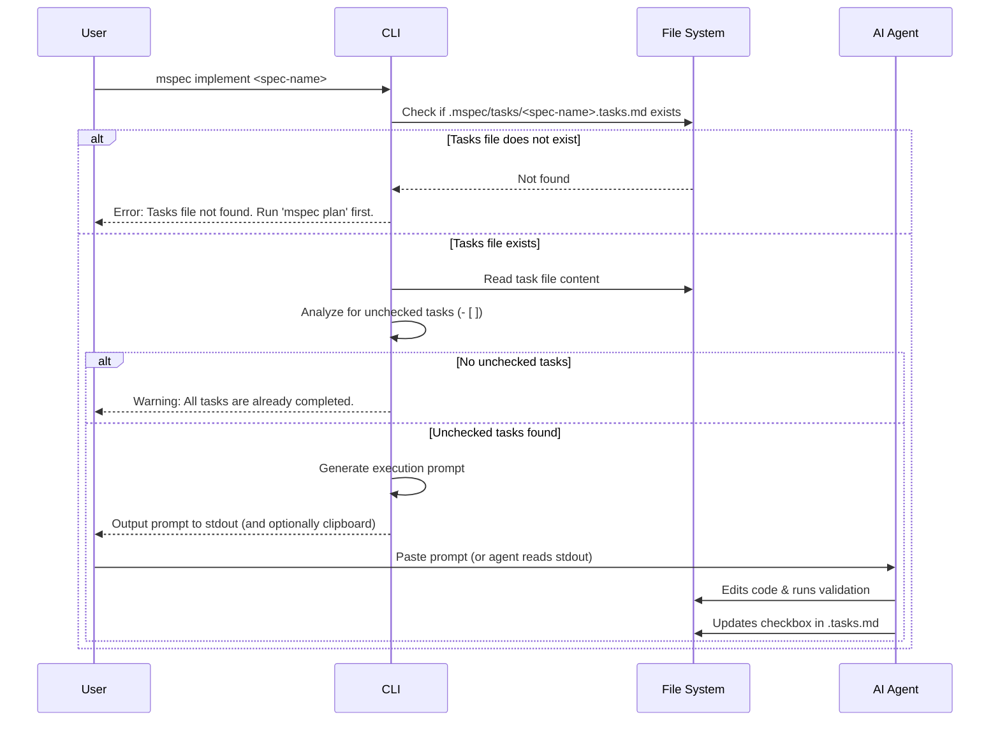

# mspec implement Command

## Goal
To orchestrate the execution of a completed task checklist by providing the AI agent with strict instructions on how to process the `.tasks.md` file sequentially.

## Context
Unlike standard build tools, `mspec implement` doesn't execute code directly. Instead, it reads the `.tasks.md` file and outputs a highly structured prompt to `stdout` (or copies it to the clipboard). This prompt is designed to be pasted to an AI agent (or automatically intercepted by agents like Claude Code or Gemini CLI). It commands the agent to read the tasks, pick the first incomplete one, implement it, run tests, update the checklist, and then stop or proceed based on user preference.

## Logic Flow

## Data Dictionary (CLI Arguments)

| Field | Type | Description | Constraints |
| :--- | :--- | :--- | :--- |
| `spec-name` | `string` | The name of the spec file to implement. | Must be a valid filename (e.g., `001-auth`) |
| `--batch` | `boolean` | Flag to instruct the AI to do all tasks at once instead of one-by-one. | Optional (default: false) |

## The Execution Prompt Template
When the CLI runs, it should output a string similar to this to guide the AI:

> **mspec execution directive:**
> Please read `.mspec/tasks/[spec-name].tasks.md`. 
> 1. Find the first incomplete task marked with `- [ ]`.
> 2. Implement the requirements for that specific task.
> 3. Verify your implementation (run tests/build).
> 4. If successful, change the task to `- [x]` in the file.
> 5. [If --batch is false]: Stop and wait for my approval before moving to the next task.
> [If --batch is true]: Continue to the next task until the phase is complete.