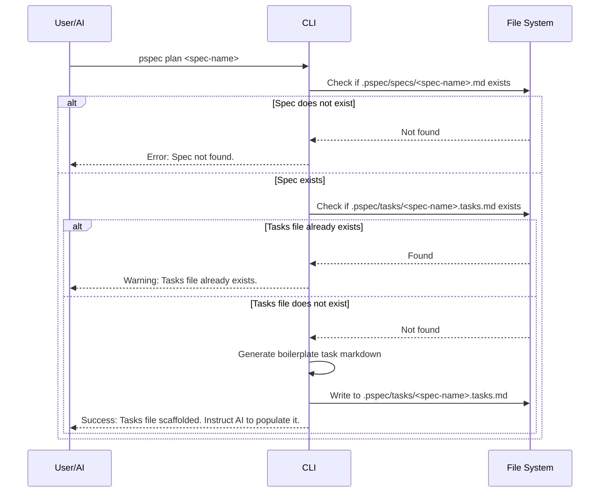

# pspec plan Command

## Goal
Prepare a specific feature specification for implementation by generating the corresponding task tracking file and validating the spec's existence.

## Context
While the AI agent does the heavy lifting of breaking down a spec into tasks, the `pspec plan <spec-name>` CLI command acts as a scaffolding helper. It ensures the environment is strictly managed, preventing the AI from creating task files in the wrong directories or with the wrong naming conventions. It creates a boilerplate `.tasks.md` file that the AI can then read and populate.

## Logic Flow



## Data Dictionary (CLI Arguments)

| Field | Type | Description | Constraints |
| :--- | :--- | :--- | :--- |
| `spec-name` | `string` | The name of the spec file without the `.md` extension. | Must be a valid filename (e.g., `001-auth`) |

## Boilerplate Task Template
When generating the `<spec-name>.tasks.md` file, the CLI should output this exact structure to guide the AI:

```markdown
# Implementation Tasks: [spec-name]

> **AI INSTRUCTION:** Read `.pspec/specs/[spec-name].md`. Break down the requirements into granular, sequential implementation tasks below. Use checkboxes (`- [ ]`). Group by phases.

## Phase 1: Setup & Scaffolding
- [ ] ...

## Phase 2: Core Logic
- [ ] ...

## Phase 3: Validation
- [ ] ...
```