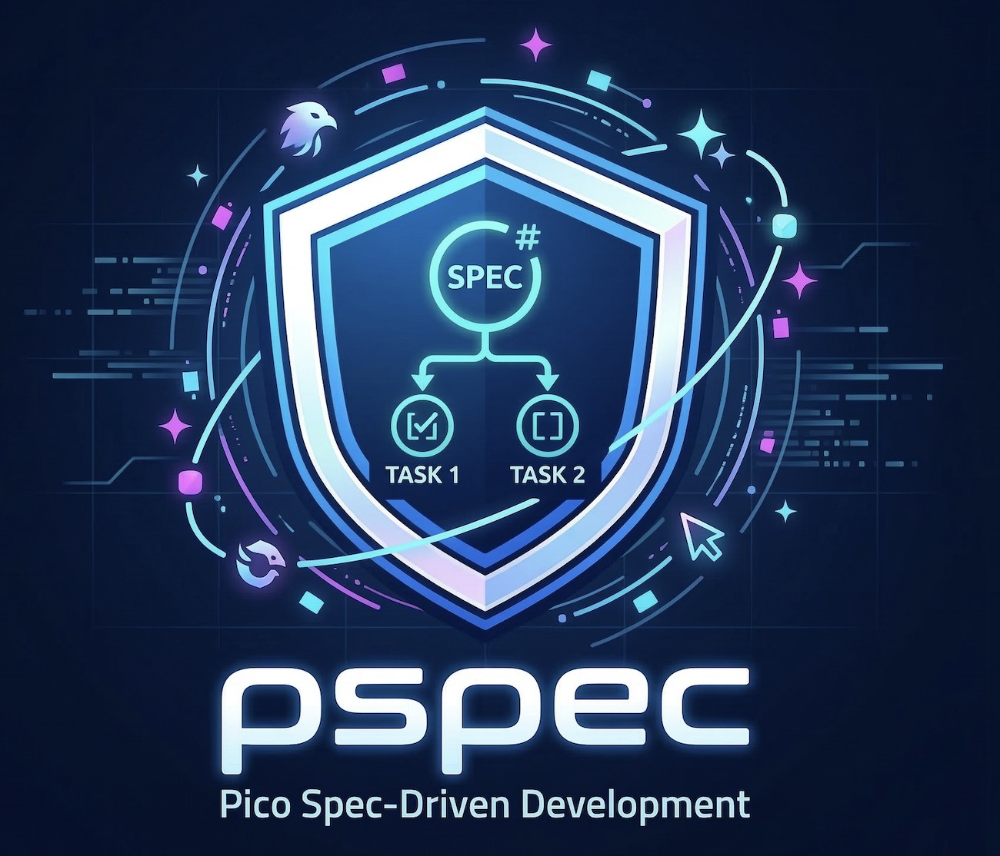

# pspec

[](https://www.npmjs.com/package/pspec)
[](https://github.com/rzkmak/pspec/actions/workflows/ci.yml)
[](./LICENSE)

<p align="center">
  
</p>

> **A minimalist Spec-Driven Development (SDD) toolkit for solo developers and AI agents.**

`pspec` (picospec) is a lightweight alternative to heavy SDD frameworks. It is the smallest specification workflow for a solo developer. It removes the "enterprise theater" (branch-per-feature, complex state files, and heavy daemon processes) and focuses strictly on **intent** (the Spec) and **execution** (the Tasks) using simple Markdown files.

It is designed to work seamlessly alongside your favorite AI coding agents: Claude Code, Gemini CLI, Cursor, OpenCode, Roo Code, and Kilo Code.

## Philosophy
- **Token Efficient:** Uses a single spec `*.md` and task `*.tasks.md` file for context instead of massive chat histories.
- **Visual-First:** Encourages Mermaid.js diagrams over long, confusing paragraphs.
- **Data Dictionaries:** Uses simple Markdown tables for data modeling instead of strict, unreadable JSON schemas.
- **Direct Execution:** The AI implements tasks directly following embedded constraints and patterns, without complex orchestration layers.

---

## Installation

We recommend running `pspec` directly via `npx` so you always get the freshest, most up-to-date prompts for your AI agents when initializing a new project.

```bash
npx pspec@latest
```

---

## How to Use

The workflow follows a simple three-step loop: **Initialize -> Plan -> Implement**.

### Step 1: Initialize the Project
Run this command in the root of your project:
```bash
npx pspec@latest
```
- It will prompt you for your preferred AI agent (Claude, Gemini, Cursor, etc.).
- It will create the `.pspec/specs/` and `.pspec/tasks/` directories.
- It will automatically inject custom commands into your project (e.g., `.gemini/commands/pspec.plan.toml` or `.cursor/rules/pspec.implement.mdc`) so your AI agent natively understands the framework and provides autocomplete commands like `/pspec.spec`.
- **Note:** If you already have `.pspec` in your project, running this command will **update** your local AI instructions to the latest version without overwriting your specs or tasks.

*(Note: After running `init`, you may need to restart your AI agent session so it can detect the new slash commands).*

### Step 2: The Inquiry (Creating a Spec)
Use the native slash command in your AI agent to start drafting a specification.

**Command:**
```text
/pspec.spec Let's create a spec for a new authentication feature.
```
- **Context Gathering:** The AI will automatically look at your existing codebase to understand your current architecture before answering.
- **The Inquiry:** It will not guess. Instead, it will ask you multiple-choice questions to define the core logic, edge cases, and data models.
  
  *Example Interaction:*
  > **AI:** Q1: How should we handle session storage?
  > Option A: JWT in HTTP-only cookies (Pros: Secure against XSS. Cons: Harder to invalidate).
  > Option B: Redis-backed sessions (Pros: Easy to revoke. Cons: Requires setting up Redis).
  > Option C: (Custom, please type your answer)
  >
  > **You:** Q1: A
  
- **Approval Checkpoint 1:** After you answer, the AI will ask: *"Are you ready for me to draft the specification based on these answers? (Please reply 'Approved' or 'LGTM')"*
- **Drafting:** Once approved, it will generate a highly structured `.pspec/specs/1742451234567-auth.md` file featuring a Mermaid diagram and an Acceptance Criteria checklist.
- **Approval Checkpoint 2:** It will output the file path for your review and wait for you to say **"Approved"** or **"LGTM"** again before automatically offering the next command.
- **Next Command Hint:** It should also give you a copy-pasteable follow-up command like `/pspec.plan 1742451234567-auth` so you do not need to retype the generated stem manually.

### Step 3: Scaffold the Plan
Once you are happy with the spec, use the planning command to break it down.

**Command:**
```text
/pspec.plan 1742451234567-auth
```
- If you don't provide a spec name, the AI will choose the most relevant recent spec.
- **Sequencing:** The AI reads the spec and produces a strictly sequenced task file at `.pspec/tasks/1742451234567-auth.tasks.md`, following the order: setup → core logic → integration → validation → tests.
- **Naming:** Spec files use the format `<epoch-ms>-<slug>.md`, and task files reuse the same stem as `<epoch-ms>-<slug>.tasks.md`.
- **Next Command Hint:** After writing the task file, it suggests a ready-to-run follow-up like `/pspec.implement 1742451234567-auth`.
- It will show you the exact file path so you can review the generated tasks and ask for your approval before proceeding.

**Task file format:**

Task files are hybrid Markdown + YAML documents. A YAML frontmatter block provides shared context for the whole file (key files, commands, conventions). Each task is a YAML code block under its own heading:

```yaml
---
spec: .pspec/specs/1742451234567-auth.md
stem: 1742451234567-auth
created: 2024-01-17T14:30:00Z
context:
  key_files:
    - src/auth/
    - src/types/
  patterns:
    - "Follow handler pattern in src/users/handlers.ts"
  commands:
    test: "npm test"
    lint: "npm run lint"
    build: "npm run build"
  conventions:
    naming: "camelCase functions, PascalCase types"
    exports: "Named exports only"
---
```

```yaml
## Task 1
id: 1
title: Create User type definition
tag: TRIVIAL
spec_ref: "Section 2.1: Data Model"
depends_on: []
files:
  create:
    - path: src/types/user.ts
      description: "User interface and auth-related types"
    - path: src/types/user.test.ts
      description: "Type-level tests for User definitions"
  modify: []
  reference:
    - path: src/types/post.ts
      reason: "Follow existing type definition pattern"
approach: |
  1. Create src/types/user.ts
  2. Define User interface with id, email, passwordHash, createdAt
  3. Define UserCreateInput omitting id and createdAt
  4. Define UserResponse omitting passwordHash
  5. Export all types as named exports
inputs: null
outputs: null
verify:
  command: "npm run build"
  expected: "Build succeeds with no type errors"
done_when:
  - "User, UserCreateInput, UserResponse exported from src/types/user.ts"
  - "Build passes"
```

Every task includes an `approach` (numbered steps), `files.reference` (patterns to follow), `verify` (exact command and expected outcome), and `done_when` (checkable acceptance criteria). Test files are always included for every new file and every new function or method introduced.

### Step 4: Implement and Execute
Once the task file is generated, hand the wheel over to the AI to implement the tasks.

**Command:**
```text
/pspec.implement 1742451234567-auth
```
- If you don't provide a spec name, the AI will use the most recently updated matching task file.
- **Context-First:** The AI parses the YAML frontmatter to get key files, conventions, and commands — no redundant codebase exploration.
- **Sequential Execution:** Tasks run in `id` order, respecting `depends_on`. `CRITICAL` tasks run one at a time with full verification. Adjacent `TRIVIAL` tasks with the same dependencies are batched.
- **Test Coverage:** For every new file and every new function or method, the AI creates or updates the corresponding test file.
- **Empirical Verification:** The AI runs the exact `verify.command` from the task, checks every item in `done_when`, and only marks a task `[x]` when all criteria pass.
- It reports a compact result (status, files changed, verification outcome) when all tasks are complete.

### Step 5: Debugging and Maintenance
If you encounter bugs, compile errors, or failing tests (whether during implementation or in normal development), use the debug command.

**Command:**
```text
/pspec.debug [error log or description]
```
- **Direct Triage:** The AI will automatically search the codebase for the error's source and fix it directly.
- **Repro-First:** It will create a minimal reproduction script to confirm the bug before applying a fix.
- **Parallel Investigation:** If there are multiple potential causes, it can investigate them to find the solution faster.
- **PSpec-Aware:** It will check if the bug is related to any active tasks or existing specs to ensure consistency.

### Step 6: Commit Helpers
If you want the agent to package current work for you, use one of the git helper commands.

**Commands:**
```text
/pspec.commit-raise-pr
/pspec.commit-current-branch
```
- `/pspec.commit-raise-pr` creates a new inferred branch name, stages all safe files, commits them, pushes that branch, and opens a PR against the repository default branch with `gh`.
- `/pspec.commit-current-branch` stays on the current branch, stages all safe files, commits them, and pushes to that branch.
- Both commands infer the commit message from the staged diff after staging and recent commit style, skip likely secret files unless explicitly requested, and use `gh` for GitHub operations.


### Release Publishing
- Add an `NPM_TOKEN` repository secret with publish access to the npm package.
- Publishing is automated by `.github/workflows/npm-publish.yml`.
- When a GitHub Release is published, the workflow installs dependencies, runs `npm test`, validates that the release tag matches `package.json` (`v0.0.7` and `0.0.7` both work), and then runs `npm publish`.
- Stable releases publish with the npm dist-tag `latest`; prerelease versions such as `1.2.3-beta.1` publish to the matching dist-tag like `beta`.


---

## Directory Structure
A project using `pspec` will look like this:

```text
your-project/
├── .pspec/
│   ├── pspec.json                 # Auto-generated config
│   ├── specs/
│   │   └── 1742451234567-auth.md  # The "Intent" (Markdown/Mermaid)
│   └── tasks/
│       └── 1742451234567-auth.tasks.md # The "Execution" (Checklists)
├── .opencode/                     # OpenCode agent commands
│   └── commands/
│       ├── pspec.commit-current-branch.md
│       ├── pspec.commit-raise-pr.md
│       ├── pspec.spec.md
│       ├── pspec.plan.md
│       ├── pspec.implement.md
│       └── pspec.debug.md
├── .gemini/                       # Gemini CLI commands
│   └── commands/
│       ├── pspec.commit-current-branch.toml
│       ├── pspec.commit-raise-pr.toml
│       ├── pspec.spec.toml
│       ├── pspec.plan.toml
│       ├── pspec.implement.toml
│       └── pspec.debug.toml
├── .claude/                       # Claude Code commands
│   └── commands/
│       ├── pspec.commit-current-branch.md
│       ├── pspec.commit-raise-pr.md
│       ├── pspec.spec.md
│       ├── pspec.plan.md
│       ├── pspec.implement.md
│       └── pspec.debug.md
├── .cursor/                       # Cursor rules and commands
│   ├── commands/
│   │   ├── pspec.commit-current-branch.md
│   │   ├── pspec.commit-raise-pr.md
│   │   ├── pspec.spec.md
│   │   ├── pspec.plan.md
│   │   ├── pspec.implement.md
│   │   └── pspec.debug.md
│   └── rules/
│       ├── pspec.commit-current-branch.mdc
│       ├── pspec.commit-raise-pr.mdc
│       ├── pspec.spec.mdc
│       ├── pspec.plan.mdc
│       ├── pspec.implement.mdc
│       └── pspec.debug.mdc
├── .roo/                          # Roo Code commands
│   └── commands/
│       ├── pspec.commit-current-branch.md
│       ├── pspec.commit-raise-pr.md
│       ├── pspec.spec.md
│       ├── pspec.plan.md
│       ├── pspec.implement.md
│       └── pspec.debug.md
├── .kilo/                         # Kilo Code commands
│   └── commands/
│       ├── pspec.commit-current-branch.md
│       ├── pspec.commit-raise-pr.md
│       ├── pspec.spec.md
│       ├── pspec.plan.md
│       ├── pspec.implement.md
│       └── pspec.debug.md
├── src/                           # Your actual code
└── package.json
```
